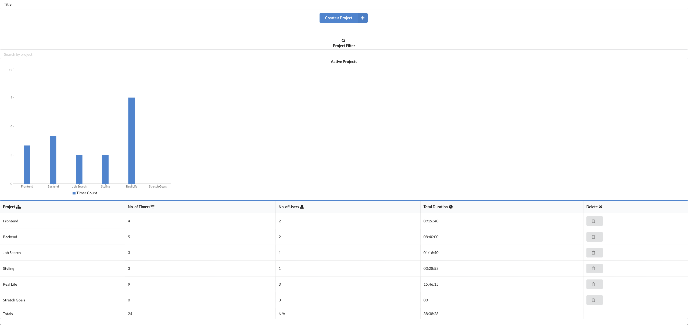
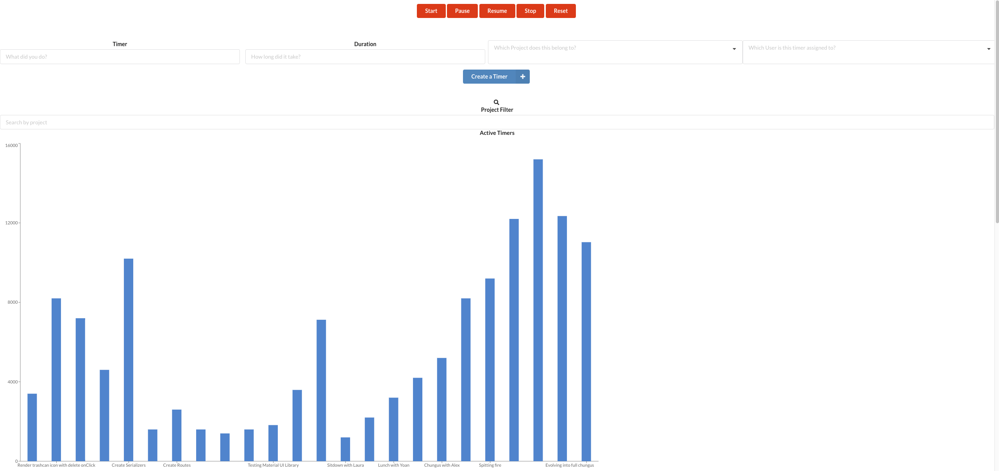
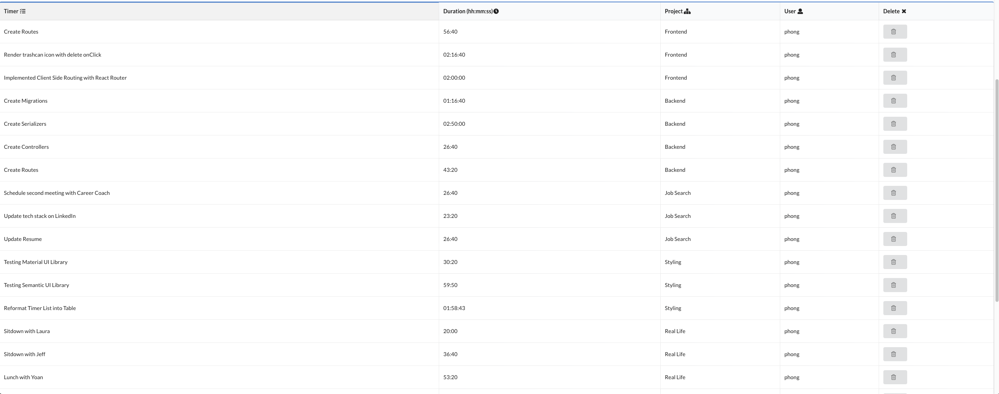

# React PMA (Project Management App)

## Description

- React PMA is a simple task manager and time tracker application that let's users quickly add tasks and assign them to different projects as well as input the duration/time they spent on a certain tasks
- React PMA also has a visualization aspect that let's the users see in a chart how much time they have spent on a certain project or individual tasks
- In the Timers page, there is a stopwatch functionality to help users quickly start tracking time spent on a new task and can be used to later input in the list of tasks performed

## Tech Stack

### Backend

- Ruby on Rails

### Frontend

- React.js

### External Libraries

- Semantic React
- Moment.js
- React Router

## Installation

- In react-pma-frontend run : `npm install` & `npm start`
- In react-pma-backend run: `bundle install` & `rails s -p 5000`

## Screenshots

